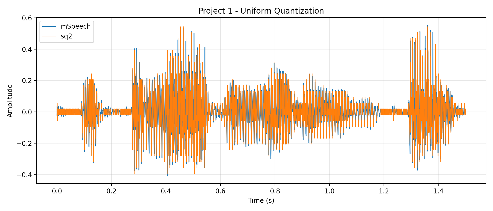
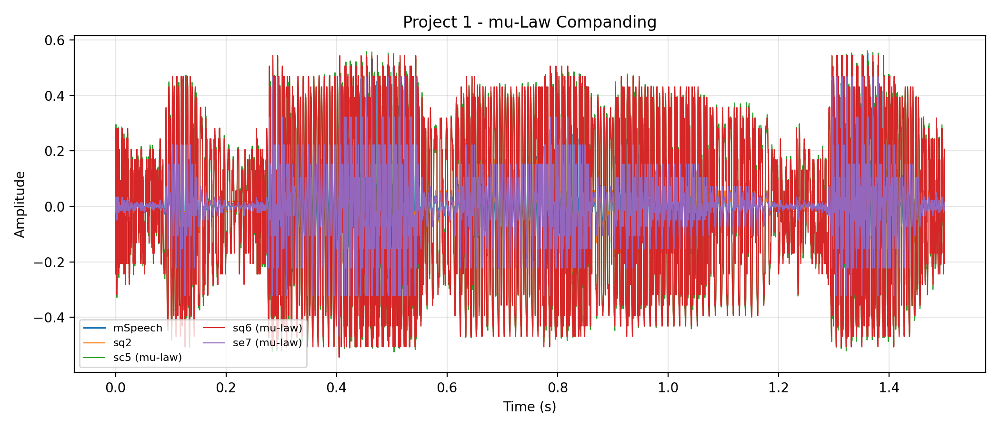
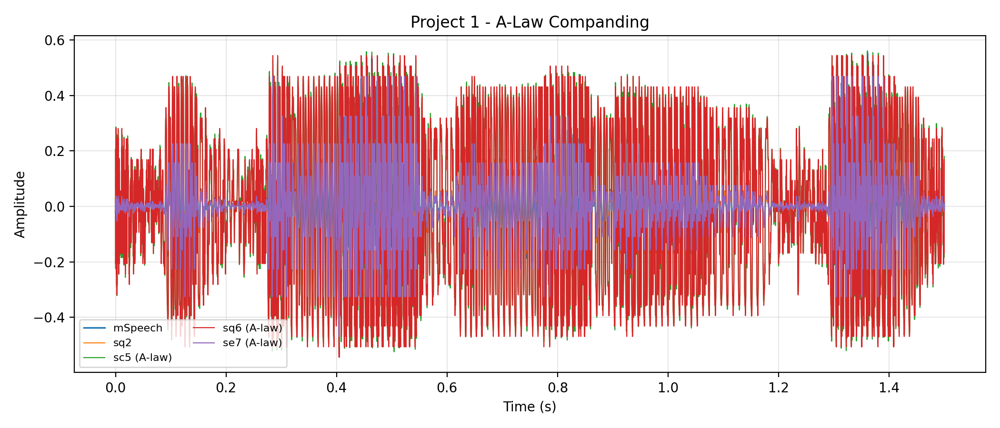
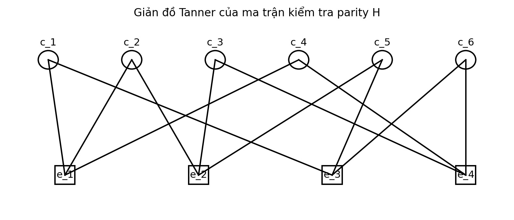

# Truyen Thong So - Digital Communications MATLAB Labs

<p align="center">
  
</p>

<p align="center">
  
  
  
  
</p>

This repository collects MATLAB coursework and group project artifacts for **Truyen thong so / Digital Communications** at the Faculty of Electronics and Telecommunications, VNUHCM - University of Science.

The work demonstrates simulation-based understanding of digital communication systems: signal-space representation, AWGN channels, matched-filter detection, binary/passband modulation, QPSK, companding for speech signals, and LDPC decoding.

## Engineering Scope

<table>
  <tr>
    <td width="33%">
      <b>Detection in AWGN</b><br />
      Binary signal transmission, noise modeling, matched-filter recovery, decision thresholding, and simulated-vs-theoretical bit error probability.
    </td>
    <td width="33%">
      <b>Digital Modulation</b><br />
      BASK, BPSK, BFSK and QPSK passband systems with BER curves over Eb/N0 using Monte Carlo simulation.
    </td>
    <td width="33%">
      <b>Source / Channel Coding</b><br />
      A-law and mu-law speech companding, uniform quantization, SNR comparison, LDPC Tanner graph and bit-flipping decoding.
    </td>
  </tr>
</table>

## Visual Results

<p align="center">
  
  
</p>

<p align="center">
  
  
</p>

## Repository Structure

```text
.
|-- README.md
|-- RELEASE_NOTES.md
|-- Chapter3/
|   `-- 22207056_LuongHaiLong/
|       |-- Question1.m
|       `-- Question2.m
|-- Chapter4/
|   `-- 22207056_LuongHaiLong/
|       |-- Problem1.m
|       |-- Problem2.m
|       |-- Problem3.m
|       `-- Problem4.m
|-- Chapter4QPSK/
|   `-- 22207056_LuongHaiLong/
|       `-- QPSK.m
|-- Nhom5_DoAnTTS/
|   |-- Nhom5_DoAnTTS.pdf
|   |-- Nhom5_Slide_DoAnTTS.pdf
|   |-- Project1/
|   |   |-- Project1.m
|   |   |-- Project1_Brief.pdf
|   |   |-- MaleSpeech-16-4-mono-20secs.wav
|   |   `-- project1_*.png
|   `-- Project4/
|       |-- DoAn4.m
|       |-- Cau1.m
|       |-- Cau2.m
|       |-- DoAn4_Brief.pdf
|       `-- *.png
|-- Chapter3.zip
|-- Chapter4.zip
|-- Chapter4QPSK.zip
`-- Nhom5_DoAnTTS.zip
```

## Technical Contents

| Module | File(s) | Main concepts |
| --- | --- | --- |
| Chapter 3 | `Chapter3/22207056_LuongHaiLong/Question1.m` | Binary waveform generation, random bit stream construction, AWGN channel and received-signal visualization. |
| Chapter 3 | `Chapter3/22207056_LuongHaiLong/Question2.m` | Matched-filter detection, decision thresholding, BER simulation and theoretical error probability comparison. |
| Chapter 4 - BASK | `Chapter4/22207056_LuongHaiLong/Problem1.m` | Binary ASK modulation, coherent matched-filter receiver and BER over Eb/N0. |
| Chapter 4 - BPSK | `Chapter4/22207056_LuongHaiLong/Problem2.m` | Antipodal BPSK signaling, zero-threshold detection and BER comparison. |
| Chapter 4 - BFSK | `Chapter4/22207056_LuongHaiLong/Problem3.m` | Orthogonal BFSK carriers, matched-filter decision variable and simulated BER. |
| Chapter 4 - BER summary | `Chapter4/22207056_LuongHaiLong/Problem4.m` | Semilog BER comparison between BASK, BPSK and BFSK. |
| QPSK | `Chapter4QPSK/22207056_LuongHaiLong/QPSK.m` | Four-symbol constellation, two orthonormal basis functions, nearest-distance detection and BER. |
| Project 1 | `Nhom5_DoAnTTS/Project1/Project1.m` | Speech quantization, A-law/mu-law companding, expansion and SNR evaluation. |
| Project 4 | `Nhom5_DoAnTTS/Project4/DoAn4.m` | LDPC parity-check matrix, Tanner graph rendering, syndrome check and bit-flipping decoding. |
| Reports | `Nhom5_DoAnTTS/*.pdf` | Course report and presentation slide deck for Project 1 and Project 4. |

## How To Run

Requirements:

- MATLAB with Signal Processing / Communications-related functions available.
- For `Project1.m`, keep `MaleSpeech-16-4-mono-20secs.wav` in the same folder as the script.
- Run scripts from their own directory or let the scripts resolve `baseDir` where implemented.

Example MATLAB workflow:

```matlab
cd('D:\TTS\Nhom5_DoAnTTS\Project1')
run('Project1.m')

cd('D:\TTS\Nhom5_DoAnTTS\Project4')
run('DoAn4.m')

cd('D:\TTS\Chapter4QPSK\22207056_LuongHaiLong')
run('QPSK.m')
```

## Project Highlights For Reviewers

- Uses Monte Carlo simulation to connect theory and measured BER behavior.
- Implements coherent matched-filter receivers for BASK, BPSK, BFSK and QPSK.
- Compares modulation robustness using semilog BER curves over Eb/N0.
- Processes a real speech sample through uniform quantization and companding pipelines.
- Builds an LDPC Tanner graph and performs iterative bit-flipping error correction.
- Includes source code, reports, slides, generated plots and original submission archives.

## GitHub Metadata

**Repository description**

```text
Digital Communications MATLAB coursework: AWGN matched-filter detection, BASK/BPSK/BFSK/QPSK BER simulation, A-law/mu-law companding, LDPC decoding, reports and slides.
```

**Suggested topics**

```text
digital-communications, matlab, signal-processing, telecommunications, awgn, matched-filter, ber, bask, bpsk, bfsk, qpsk, ldpc, channel-coding, companding, a-law, mu-law, hcmus
```

## Release

Initial release: `v1.0.0` - public portfolio version of the Digital Communications MATLAB labs and group project package.

## Academic Note

This repository is organized as a coursework portfolio and learning archive. Reports, briefs and slides are retained for academic traceability; original ownership belongs to the listed authors and course staff where applicable.
