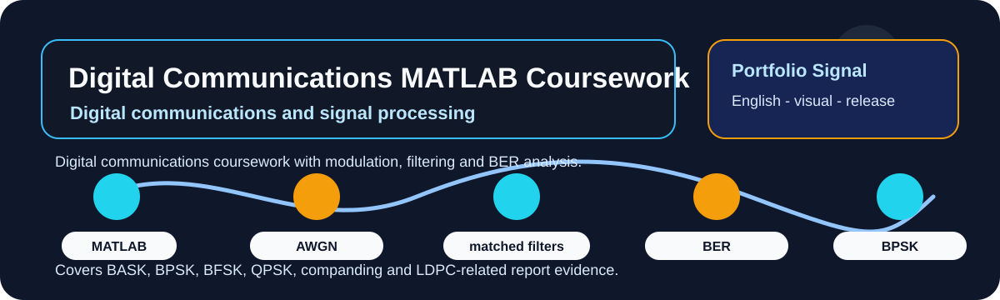
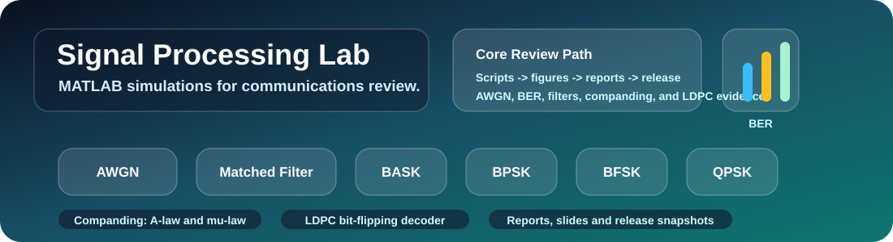
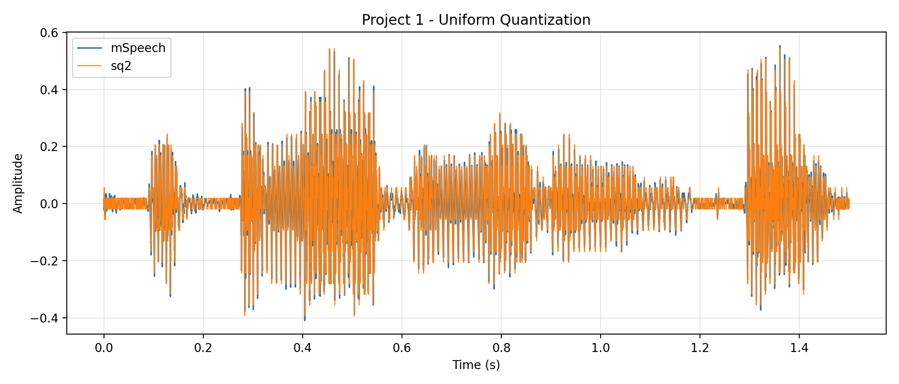
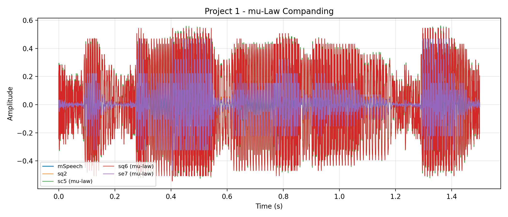
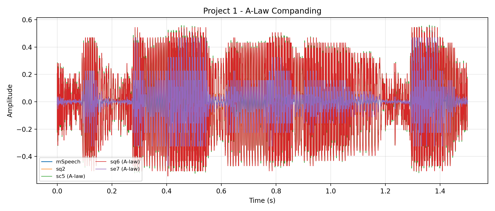
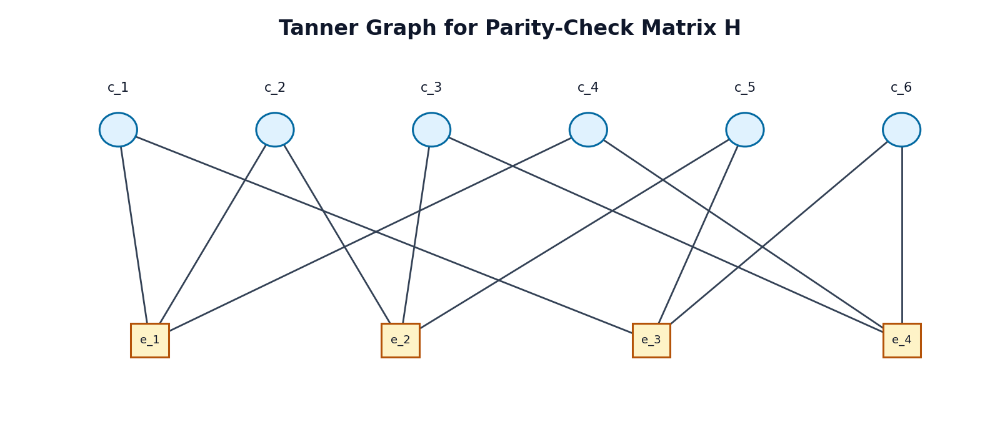

# Digital Communications MATLAB Coursework

<p align="center">
  <a href="https://github.com/lhlizdabezt/TruyenThongSo/releases/latest"></a>
  <a href="https://github.com/lhlizdabezt/TruyenThongSo/tags"></a>
  
  
</p>

<p align="center">
  
</p>

## Overview

`TruyenThongSo` is a digital communications coursework repository focused on MATLAB simulation, signal-space reasoning and report-backed engineering evidence. It covers AWGN channels, matched filters, bit-error-rate comparison, passband modulation, speech companding and LDPC decoding exercises.

| Field | Details |
|---|---|
| Repository | [lhlizdabezt/TruyenThongSo](https://github.com/lhlizdabezt/TruyenThongSo) |
| Portfolio category | Digital communications, telecommunications and signal processing |
| Primary stack | MATLAB, Communications Toolbox concepts, AWGN, matched filters, BER, BASK, BPSK, BFSK, QPSK, A-law, mu-law, LDPC |
| Evidence artifacts | MATLAB scripts, generated figures, report PDFs, slide PDF, release snapshots and source archives |
| Latest release | [GitHub Releases](https://github.com/lhlizdabezt/TruyenThongSo/releases/latest) |
| Owner profile | [Luong Hai Long](https://github.com/lhlizdabezt) |

## Reviewer Guide

| Review Goal | Start Here | Evidence |
|---|---|---|
| Understand the technical scope | `README.md`, `Chapter3/`, `Chapter4/`, `Chapter4QPSK/` | MATLAB scripts for binary signalling, passband modulation and QPSK |
| Review coursework reports | `Nhom5_DoAnTTS/Nhom5_DoAnTTS.pdf`, `Nhom5_DoAnTTS/Nhom5_Slide_DoAnTTS.pdf` | Report and slide evidence for companding and LDPC work |
| Inspect generated results | `Nhom5_DoAnTTS/Project1/*.png`, `Nhom5_DoAnTTS/Project4/*.png` | Saved MATLAB figures and command-output captures |
| Download stable snapshots | [Releases](https://github.com/lhlizdabezt/TruyenThongSo/releases/latest) and [tags](https://github.com/lhlizdabezt/TruyenThongSo/tags) | Versioned review points for HR and engineering reviewers |

## Technical Coverage

<p align="center">
  
</p>

| Area | What the Repository Shows |
|---|---|
| Signal-space detection | Binary waveform generation, AWGN injection, matched-filter recovery and threshold decisions |
| BER simulation | Simulated and theoretical error probability for BASK, BPSK, BFSK and QPSK |
| Passband modulation | Carrier-based BASK, BPSK, BFSK and QPSK waveform simulation in MATLAB |
| Speech companding | Uniform quantization, mu-law compression/expansion, A-law compression/expansion and SNR comparison |
| LDPC basics | Tanner graph construction, parity-check matrix reasoning and bit-flipping decoding |

## Result gallery

<table>
  <tr>
    <td width="50%"><br /><sub>Uniform quantization of the speech sample.</sub></td>
    <td width="50%"><br /><sub>Mu-law compression, quantization, and expansion.</sub></td>
  </tr>
  <tr>
    <td width="50%"><br /><sub>A-law compression, quantization, and expansion.</sub></td>
    <td width="50%"><br /><sub>Tanner graph generated from the checked-in parity-check matrix.</sub></td>
  </tr>
</table>

## Repository Structure

| Path | Purpose |
|---|---|
| `Chapter3/22207056_LuongHaiLong/Question1.m` | Binary signal construction, AWGN channel visualization and received waveform plotting |
| `Chapter3/22207056_LuongHaiLong/Question2.m` | Matched-filter receiver and simulated-versus-theoretical error probability |
| `Chapter4/22207056_LuongHaiLong/Problem1.m` | BASK passband modulation and BER calculation |
| `Chapter4/22207056_LuongHaiLong/Problem2.m` | BPSK passband modulation and BER calculation |
| `Chapter4/22207056_LuongHaiLong/Problem3.m` | BFSK passband modulation and BER calculation |
| `Chapter4/22207056_LuongHaiLong/Problem4.m` | Comparative BER plot for BASK, BPSK and BFSK |
| `Chapter4QPSK/22207056_LuongHaiLong/QPSK.m` | QPSK signal-space detection and BER comparison |
| `Nhom5_DoAnTTS/Project1/Project1.m` | Uniform quantization, mu-law, A-law and speech-signal SNR analysis |
| `Nhom5_DoAnTTS/Project4/DoAn4.m` | LDPC Tanner graph and bit-flipping decoder demonstration |
| `Nhom5_DoAnTTS/*.pdf` | Final report and presentation deck for the digital communications project |
| `*.zip` | Original packaged coursework snapshots preserved for review continuity |

## How to Run

1. Install MATLAB. The scripts use standard MATLAB syntax and communications functions such as `qfunc` and `biterr`; install the Communications Toolbox if your MATLAB distribution does not already provide them.
2. Clone the repository:

   ```powershell
   git clone https://github.com/lhlizdabezt/TruyenThongSo.git
   cd TruyenThongSo
   ```

3. Open MATLAB from the repository root or add the target script folder to the MATLAB path.
4. Run the desired script from its own folder so saved figures are written beside the source file:

   ```matlab
   cd Chapter4QPSK/22207056_LuongHaiLong
   QPSK
   ```

5. For the companding project, run from `Nhom5_DoAnTTS/Project1` because `Project1.m` loads `MaleSpeech-16-4-mono-20secs.wav` from the same folder.
6. For the LDPC project, run from `Nhom5_DoAnTTS/Project4`; `DoAn4.m` saves `tanner_ldpc.png` in that folder.

## Suggested Review Order

1. `Chapter3/22207056_LuongHaiLong/Question2.m` for matched-filter detection under AWGN.
2. `Chapter4/22207056_LuongHaiLong/Problem1.m` through `Problem4.m` for BASK, BPSK, BFSK and comparative BER.
3. `Chapter4QPSK/22207056_LuongHaiLong/QPSK.m` for two-bit symbol mapping and QPSK decision logic.
4. `Nhom5_DoAnTTS/Project1/Project1.m` for companding and SNR evidence.
5. `Nhom5_DoAnTTS/Project4/DoAn4.m` for LDPC parity-check and decoder reasoning.
6. `Nhom5_DoAnTTS/Nhom5_DoAnTTS.pdf` and `Nhom5_DoAnTTS/Nhom5_Slide_DoAnTTS.pdf` for report-level context.

## Scope and Boundaries

This is an academic digital communications repository. It demonstrates MATLAB modelling, signal-processing foundations and report discipline; it is not a production modem, radio stack or telecom network implementation.

## Release Downloads

| Artifact | Purpose |
|---|---|
| [Digital communications report](https://github.com/lhlizdabezt/TruyenThongSo/releases/latest/download/Nhom5_DoAnTTS.pdf) | Companding, LDPC, results, and project discussion |
| [Presentation deck](https://github.com/lhlizdabezt/TruyenThongSo/releases/latest/download/Nhom5_Slide_DoAnTTS.pdf) | Course presentation evidence |
| [Project 1 brief](https://github.com/lhlizdabezt/TruyenThongSo/releases/latest/download/Project1_Brief.pdf) | Speech companding assignment |
| [Project 4 brief](https://github.com/lhlizdabezt/TruyenThongSo/releases/latest/download/DoAn4_Brief.pdf) | LDPC assignment |
| [Source snapshot](https://github.com/lhlizdabezt/TruyenThongSo/releases/latest/download/TruyenThongSo-source-v1.2.2.zip) | Full tracked repository state |
| [Portfolio visual](https://github.com/lhlizdabezt/TruyenThongSo/releases/latest/download/portfolio-motion.svg) | Stable English project summary |

## Portfolio Context

Luong Hai Long uses this repository as telecommunications evidence within a broader engineering portfolio that also includes computer vision, AI/ML, embedded systems, FPGA/SoC and firmware projects. This repository is strongest as proof of digital communications fundamentals: AWGN analysis, matched filtering, BER reasoning, passband modulation and coding-theory exercises.

<details>
<summary>Contact and professional links</summary>

| Channel | Link |
|---|---|
| GitHub | [lhlizdabezt](https://github.com/lhlizdabezt) |
| LinkedIn | [linkedin.com/in/lhlizdabezt](https://www.linkedin.com/in/lhlizdabezt) |
| Facebook | [facebook.com/wageseadrake](https://www.facebook.com/wageseadrake) |
| Instagram | [instagram.com/lhlizdabezt](https://www.instagram.com/lhlizdabezt) |
| YouTube | [youtube.com/@lhlizdabezt](https://www.youtube.com/@lhlizdabezt) |
| TikTok | [tiktok.com/@wageseadrake](https://www.tiktok.com/@wageseadrake) |
| Email | [22207056@student.hcmus.edu.vn](mailto:22207056@student.hcmus.edu.vn), [luonghailong.work@gmail.com](mailto:luonghailong.work@gmail.com) |
| Phone | [+84 988 114 708](tel:+84988114708) |

</details>

## Visual Asset Policy

The checked-in SVG visuals use English ASCII-safe text. They avoid animated dashed lines, dotted routes and curved connector lines so GitHub README text does not sit behind moving graphics or become unreadable on mobile.

## Release and Tagging Notes

Releases and tags preserve stable review points for HR, academic and engineering reviewers. The latest release includes the report, presentation, assignment briefs, line-free SVG visuals, and full tracked source snapshot.
